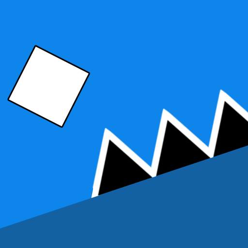

# Rhythmic Rush

<p align="center">
  
</p>


Rhythmic Rush is a fast rhythm platformer where you dodge obstacles, time your jumps, and keep moving to the beat.

## Download

- itch.io (Desktop): https://samispoggers.itch.io/rhythmic-rush
- Google Play (Android): https://play.google.com/store/apps/details?id=io.github.msameer0.rhythmicrush

## Quick Controls

- Jump / Fly: `Space`, `W`, `Up Arrow`, or left click
- Restart: `R`
- Pause: `Esc`

## For Developers

Run the desktop build locally:

```powershell
./gradlew lwjgl3:run
```

If you are working on backend services, use the separate sibling repo: `../rhythmicrush-backend`.


